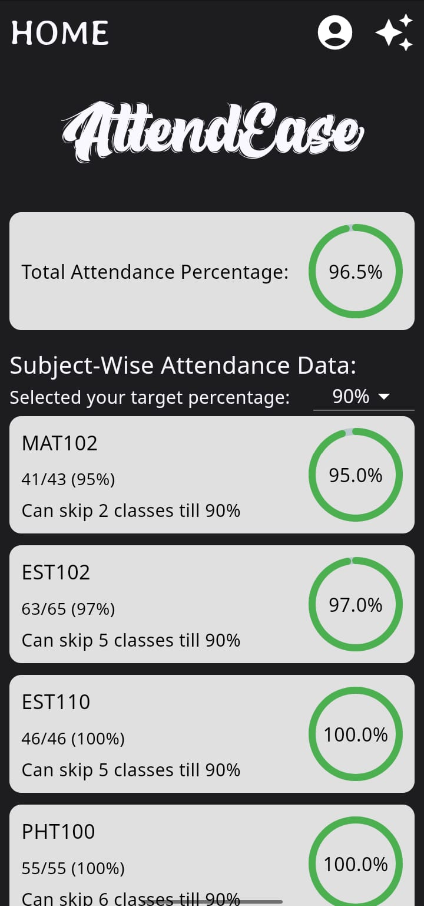
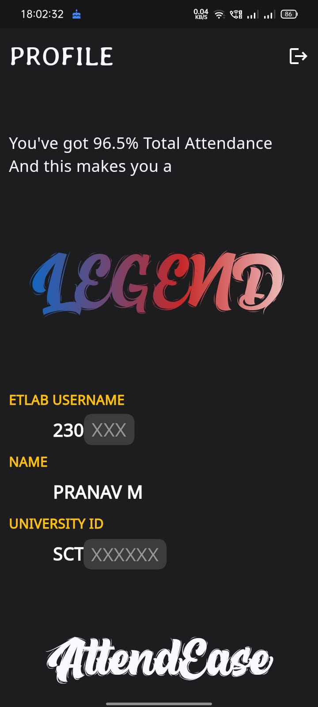
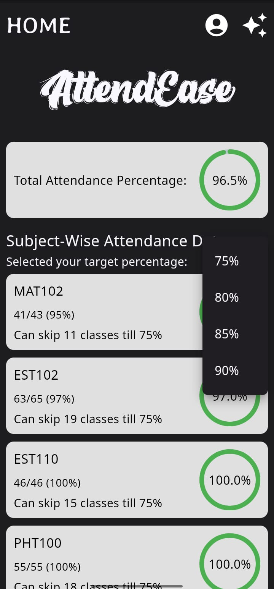

# AttendEase

## GoTo:

- [Downloading](#download-attendease)
  - [Requirements](#requirements)
- [About](#about)
- [Features](#features)
- [Screens](#screens)
  - [Feature Screens](#feature-screens)
- [Backend and APIs (The Etlab Integration)](#backend-and-apis-the-etlab-integration)
- [Bugs and Issues](#bugs-and-issues)
- [Contributing](#contributing)
- [Supporting](#supporting)

## Download AttendEase
Download AttendEase from the [Releases](https://github.com/trulyPranav/AttendEase/releases/latest). Or if you're lazy, get the apk [here!](https://github.com/trulyPranav/AttendEase/releases/download/Application-Final/attendease.apk)

### Requirements
- Android 11 and above
- 40Mb of Free Space :)

## About
AttendEase is an attendance tracker app, that essentialy provides students the amount of classes they can skip safely.
It also provides an insight on how many classes a student needs to attend.
Students can login directly with their Etlab-ID and password, and veiw the data.
Once logged in, the students are not required to re-login, and just reopen the app again to view their data!

## Features
- Login directly through Etlab
- Students need to login only once.
- NO ETLAB SURVEYS HERE !
- Students can select attendance percentages of:
    - 75%
    - 80%
    - 85% (deprecated)
    - 90%
  
  and can tailor their data accordingly.
- Shows the amount of classes a student can skip **safely** without falling below the selected attendance percentage.
- Shows the amount of classes a student need to attend in-order to reach a selected attendance percentage.
- Etlab rounds off the attendance, however I've not. So the users get the exact attendance percentage and the classes they'll have to attend, if they are short of attendance.
- A simple ranking feature, which ranks users based on the overall attendance percentage, and can be viewed through their Profile Tab.
- Finally, users can log out from their Profile Tab.

## Screens
                

### Feature Screens
    

## Backend and APIs (The Etlab Integration)
Etlab integration is achieved through web scraping. Hence, this app can be used by any institutions, just by changing the backend Etlab endpoints.
 
The Backend code can be found [here!](https://github.com/trulyPranav/fetcherAPI)
 
The current backend is specific for SCTCE, hence feel free to fork and craft your own endpoints!

## Future Releases
AttendEase will thrive with future releases for sure. New features planned for implementation include:
- Timetable of individual students.
- Downloading of Etlab Assignments and Resources from AttendEase itself.
- An internal marks calculator within the App.
- Results Viewing and Academic Performance Tracker.

## Bugs and Issues
If you encounter a bug, calculation errors, or something, feel free to create an issue. Please include detailed explanation and if you have any ways to solve them, do mention that too!

## Contributing
Ofcourse anyone can contribute to this, just do the below:
- Fork the Project
- Implement what you're planning
- Create a Pull Request
I'll surely merge after looking through it!

## Supporting
If you like the project/app, do star the repository! It'll do nothing but motivate!

